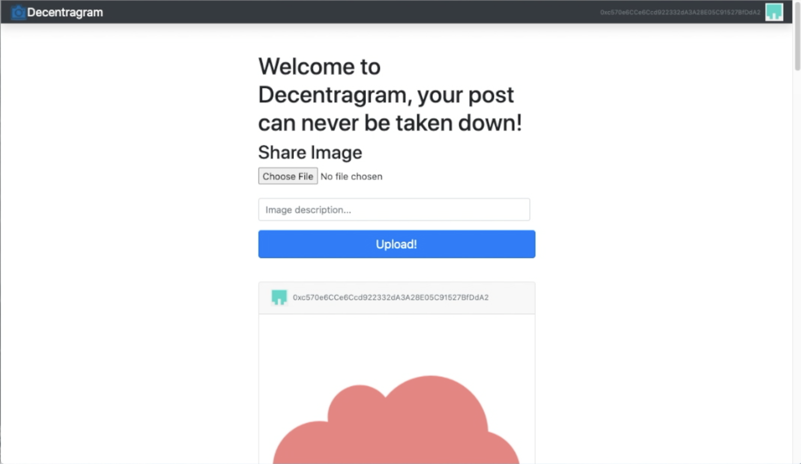
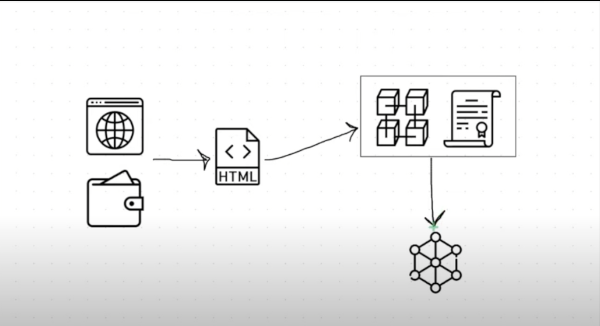

# instagramipfs
 
Build a instragram dapp with react, solidity, and web3.js 



## How to run the application 
1. Clone the respoitory 
2. Go into the directory of the repository 
3. In the terminal run ```npm install```
4. to start the web server run ```npm run start```
Use the link http:localhost:3000 to load the web application in browser.

## Application Workflow Diagram 

